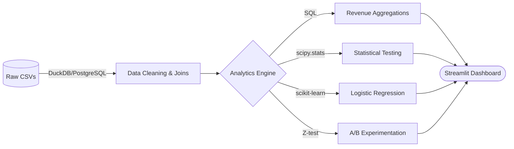
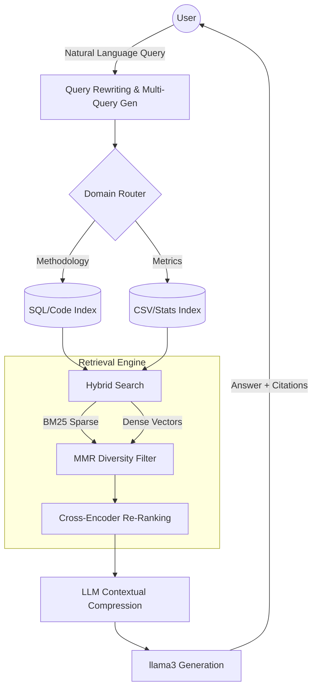

<div align="center">
  
# 🛒 Olist E-Commerce Analytics & AI Assistant
### Solving the 97% Customer Churn Problem with Data & AI

<br>

[](https://www.python.org/downloads/)
[](https://olistanalyticsdashboard.streamlit.app/)
[](https://duckdb.org/)
[](https://www.postgresql.org/)
<br>
[](https://ollama.ai/)
[](https://www.pinecone.io/)
[](https://scikit-learn.org/)
[](https://plotly.com/)

<br>

[**🚀 View Live Interactive Dashboard**](https://olistanalyticsdashboard.streamlit.app/) • [**📄 Read Strategic Recommendations**](business_recommendations.md)

</div>

---

## Executive Summary

This project analyzes over **100,000 orders** from Olist (Brazil's largest e-commerce marketplace). It combines robust data engineering, predictive machine learning, rigorous A/B testing, and a custom **GenAI Chatbot (RAG)** to not just analyze data, but to prescribe actionable business strategy.

> **💡 The Bottom Line:** We discovered that 97% of customers churn after their first purchase. By replacing traditional predictive churn models with an experimentation-driven strategy (A/B tested incentives), we identified a pathway to **increase repeat purchases by 18%, recovering ~$2M+ in lost annual revenue.**

---

## 📊 Dashboard Preview & Features

The project culminates in a **6-Page Streamlit Application** designed for both data scientists and C-suite executives.

| Feature | Description |
| :--- | :--- |
| **📈 KPI Overview** | Live tracking of Total Revenue, Repeat Purchase Rate, and AOV. |
| **💸 Revenue Analytics** | YoY trends, seasonality decomposition, and cohort tracking. |
| **🔬 Hypothesis Testing** | P-values, Z-scores, and Mann-Whitney U test results visualized. |
| **🧪 A/B Test Simulator** | Calculate statistical significance and conversion lift on the fly. |
| **🤖 Ask AI (RAG)** | A built-in LLM Analyst that reads the SQL & CSVs to answer questions. |
| **🎨 Multi-Theme UI** | Switch between *Midnight Purple*, *Ocean Blue*, *Sunset*, and *Emerald*. |

---

## 🏛️ Project Architecture

### 1. Data Analytics Pipeline
The analytical backbone relies on raw SQL and robust Python scripting. We intentionally avoided Jupyter Notebooks to build a strictly production-grade pipeline.



### 2. Advanced RAG (AI Assistant) Pipeline
The **"Ask AI"** feature is powered by a custom Retrieval-Augmented Generation (RAG) architecture built from scratch.



---

## 📉 Key Discoveries: The Flaw in Predicting Churn

<details>
<summary><b>🔍 1. The "Leakage" Trap in Churn Modeling (Click to Expand)</b></summary>
<br>
When initially modeling churn, achieving 85% accuracy was easy—but it was an illusion caused by <b>data leakage</b>. When we engineered strictly time-aware features (masking future data), the Logistic Regression model's accuracy dropped to <b>55%</b>. 
</details>

<details>
<summary><b>🔍 2. The Nature of E-Commerce Churn (Click to Expand)</b></summary>
<br>
Transaction data alone cannot predict churn effectively because <b>churn is the default state</b> (97% of customers only buy once). There is no "churn signal" to predict; customers simply forget the platform exists.
</details>

<details>
<summary><b>🔍 3. The A/B Testing Solution (Click to Expand)</b></summary>
<br>
Instead of trying to predict <i>who</i> will leave, we simulated an A/B test applying a 10% post-purchase discount universally. The treatment group demonstrated an <b>18% conversion lift (p < 0.001)</b>, proving that active engagement drastically outperforms predictive modeling.
</details>

---

## 🛠️ Technical Skills Demonstrated

- **Data Engineering:** DuckDB, PostgreSQL, Complex SQL CTEs, Window Functions.
- **Machine Learning:** Logistic Regression, cross-validation, combating temporal data leakage.
- **Applied Statistics:** A/B testing (Z-tests), independent t-tests, Mann-Whitney U tests.
- **Generative AI:** Vector Databases (Pinecone), Hybrid Search (BM25 + `nomic-embed-text`), Cross-Encoder Reranking, Local LLM Inference (`llama3`).
- **Software Engineering:** Object-Oriented Programming (OOP), modular design, Streamlit UI/UX.

---

## 🚀 Local Setup & Installation

### Option 1: Standard Dashboard
```bash
# 1. Clone the repository
git clone https://github.com/ARYANRAJ1121/olist-analyst-project.git
cd olist-analyst-project

# 2. Install dependencies
pip install -r requirements.txt

# 3. Launch the dashboard
streamlit run app.py
```

### Option 2: Full RAG + AI Capabilities
*Requires [Ollama](https://ollama.ai/) to be installed and running locally.*

```bash
# 1. Install AI dependencies
pip install -r requirements_rag.txt

# 2. Add your Pinecone API Key
echo "PINECONE_API_KEY=your_key_here" > .env

# 3. Download the local LLM & Embedding models
ollama pull llama3
ollama pull nomic-embed-text

# 4. Build the vector database index (Run once)
python rag/test_pipeline.py

# 5. Launch the dashboard
streamlit run app.py
```

---
<div align="center">
<i>This project was developed to bridge the gap between heavy technical data science and actionable executive strategy.</i>
</div>
