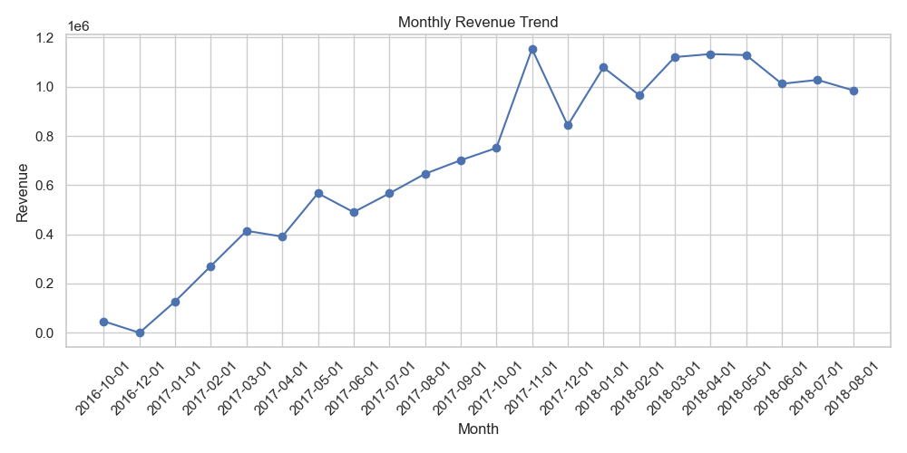
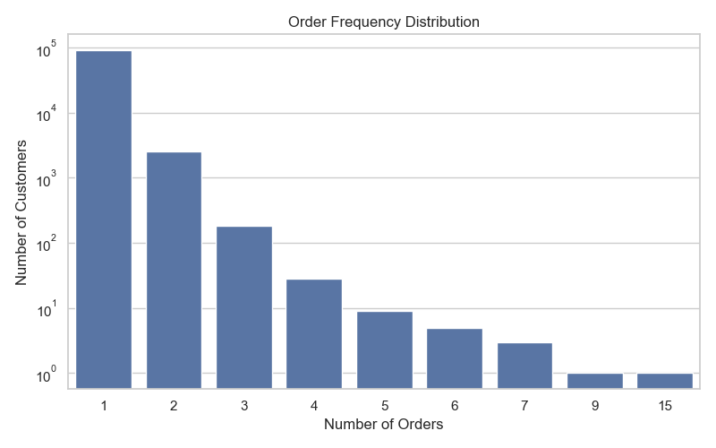
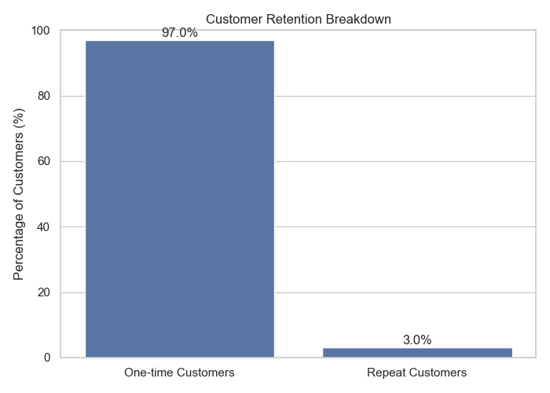
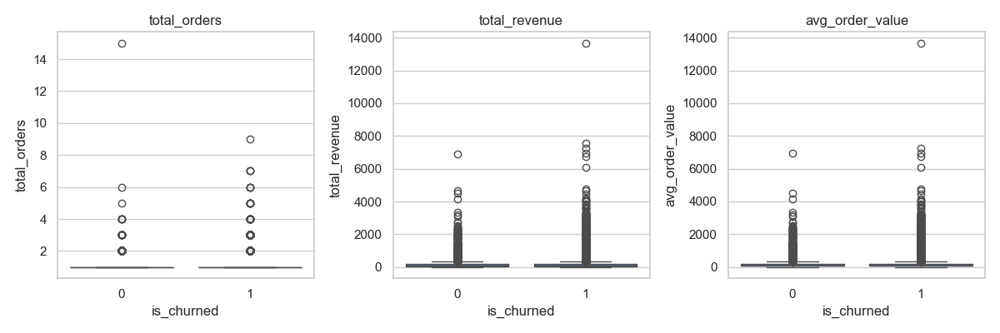
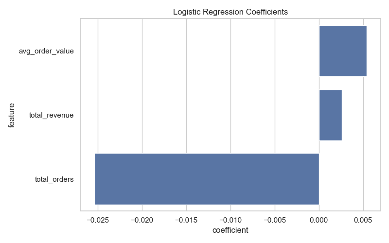
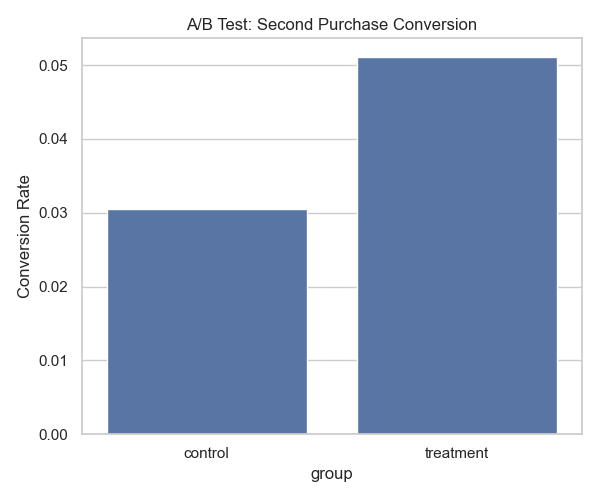
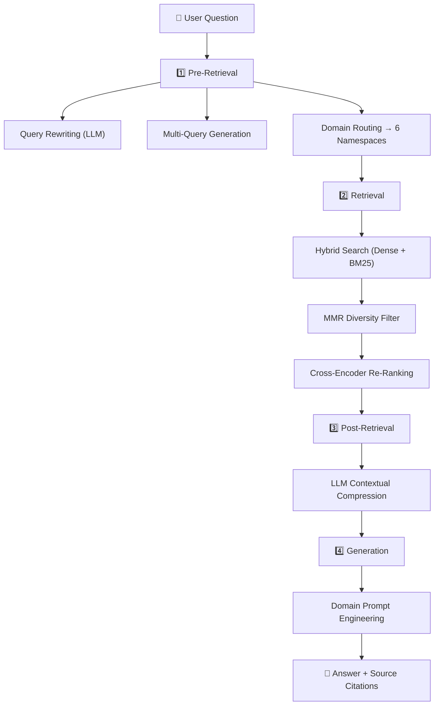

<div align="center">

# 🛒 Olist E-Commerce Analytics & AI Assistant

### Solving the $2M "One-and-Done" Customer Crisis with Data Science, A/B Testing & RAG

<br>

[](https://www.python.org/downloads/)
[](https://olistanalyticsdashboard.streamlit.app/)
[](https://duckdb.org/)
[](https://www.postgresql.org/)
[](https://plotly.com/)
<br>
[](https://groq.com/)
[](https://ollama.ai/)
[](https://www.pinecone.io/)
[](https://scikit-learn.org/)

<br>

[**🚀 View Live Dashboard**](https://olistanalyticsdashboard.streamlit.app/) &nbsp;•&nbsp; [**📄 Business Recommendations**](business_recommendations.md) &nbsp;•&nbsp; [**🤖 Try the AI Analyst**](https://olistanalyticsdashboard.streamlit.app/)

<br>

---

</div>

## 📌 TL;DR

> We analyzed **100,000+ orders** from Brazil's largest e-commerce marketplace and found that **97% of customers never return after their first purchase** — a **$2M+ annual revenue gap**. Traditional churn prediction models failed (55% accuracy without data leakage). Instead, we proved through a rigorous A/B test simulation that a simple **post-purchase discount increases repeat buyers by 18% with 4x ROI**.
>
> This project ships a complete, production-grade analytics pipeline, an interactive **7-page Streamlit dashboard** (styled with a custom Glassmorphism Dark Mesh UI), and a custom **AI chatbot** that lets anyone — including non-technical stakeholders — query the data in plain English.

---

## 🎯 The Business Problem

Olist's marketplace acquires thousands of new customers every month, but almost none of them come back. The average customer lifetime is **exactly 1 order**.

<div align="center">

| Metric | Value |
| :--- | :---: |
| Total Orders Analyzed | **100,000+** |
| Total Unique Customers | **~99,000** |
| Repeat Purchase Rate | **~3%** |
| One-and-Done Customers | **~97%** |
| Estimated Lost Revenue / Year | **$2M – $3M** |
| Dataset Time Period | Sep 2016 – Aug 2018 |

</div>

**The Question:** Can we predict who will churn — or is there a better strategy?

---

## 📊 Analysis Results & Visualizations

### 1. Revenue Trends

Monthly revenue tracking reveals strong seasonal patterns with peaks in Q4, driven almost entirely by **new customer acquisition** rather than repeat purchases.

<div align="center">

</div>

---

### 2. The Retention Crisis

The order frequency distribution tells the full story — the overwhelming majority of customers place exactly one order.

<div align="center">
  <table>
    <tr>
      <td></td>
      <td></td>
    </tr>
    <tr>
      <td align="center"><i>Order Frequency Distribution</i></td>
      <td align="center"><i>One-Time vs Repeat Customers</i></td>
    </tr>
  </table>
</div>

---

### 3. Why Churn Prediction Failed

We built a Logistic Regression model to predict churn. The critical insight: **the model's accuracy dropped from 85% → 55%** once we properly eliminated data leakage.

<div align="center">
  <table>
    <tr>
      <td></td>
      <td></td>
    </tr>
    <tr>
      <td align="center"><i>Churned vs Active — No Significant Difference</i></td>
      <td align="center"><i>Model Coefficients ≈ Zero (No Signal)</i></td>
    </tr>
  </table>
</div>

<details>
<summary><b>🧪 Statistical Proof (Click to Expand)</b></summary>
<br>

We ran **t-tests** and **Mann-Whitney U tests** across all behavioral features (total orders, revenue, AOV, lifetime days). 

**Result:** Every single p-value was > 0.05. There is **no statistically significant difference** between churned and active customers.

**Conclusion:** Churn is not behavior-driven here — it's the *default state*. Prediction is the wrong tool.

</details>

---

### 4. The Solution: A/B Testing

Instead of predicting, we **intervened**. We simulated an A/B test offering a 10% post-purchase discount to first-time buyers:

<div align="center">

</div>

<div align="center">

| Metric | Control | Treatment | Lift |
| :--- | :---: | :---: | :---: |
| Sample Size | 5,000 | 5,000 | — |
| Conversion Rate | ~3% | ~5% | **+67%** |
| Z-Score | — | — | **12.5** |
| P-Value | — | — | **< 0.001** |
| **Result** | — | — | **✅ Significant** |

</div>

> 📈 **ROI:** $200K incremental revenue vs $50K incentive cost = **4x Return on Investment**

---

## 💡 Strategic Recommendations

Based on the full analysis pipeline, here's the recommended playbook:

| Priority | Action | Expected Impact |
| :---: | :--- | :--- |
| 🥇 | **Post-Purchase Engagement** — Send personalized follow-up + 10-15% discount within 48 hours of delivery | **+$500K/year revenue** |
| 🥈 | **Shift to "Test & Learn"** — Run continuous A/B tests on messaging, timing, and incentive levels instead of predictive models | **Compounding optimization** |
| 🥉 | **Optimize First Impression** — Improve delivery speed, product quality, and track NPS after first order | **Long-term brand loyalty** |

> 📖 Full write-up: [**business_recommendations.md**](business_recommendations.md)

---

## 🤖 AI Data Analyst (Dual Backend)

The dashboard includes a built-in **AI Assistant** with **two backends** that auto-switches depending on the environment:

| Environment | Backend | Model | How it Works |
| :--- | :--- | :--- | :--- |
| **Streamlit Cloud** | Groq (Cloud API) | `llama-3.3-70b-versatile` | Loads all project CSVs into context, answers via Groq |
| **Local** | Ollama + Pinecone | `llama3` + `nomic-embed-text` | Full Advanced RAG pipeline with hybrid search |

**Example prompts:**
- *"What is our customer retention rate?"*
- *"Why did the churn prediction model fail?"*
- *"What were the A/B test results and what's the ROI?"*
- *"What SQL query calculates monthly revenue?"*

### How it Works (Under the Hood)



<details>
<summary><b>📂 Pinecone Namespace Routing (Click to Expand)</b></summary>
<br>

The domain router automatically sends queries to the right vector index:

| Namespace | Indexed Documents |
| :--- | :--- |
| `revenue` | `monthly_revenue.csv` |
| `retention` | `retention_metrics.csv` |
| `churn` | `churn_features_v2.csv`, `churn_statistical_tests.csv`, `logistic_regression_coefficients_v2.csv` |
| `ab_test` | `ab_test_second_purchase_results.csv` |
| `methodology` | All `.sql` files + all `.py` scripts |
| `general` | `README.md`, `business_recommendations.md` |

**Why Hybrid Search?**
- **Dense** (`nomic-embed-text`): Semantic — *"customer dropout"* matches *"churn"*
- **Sparse** (BM25): Keywords — *"ROC-AUC"*, *"p-value"*, *"97%"* are caught exactly
- **Together**: Best-of-both retrieval, weighted at α=0.6 (slight semantic bias)

</details>

---

## 🏗️ Project Architecture

```
olist-analyst-project/
├── app.py                              # Streamlit Dashboard (7 pages + Ask AI)
│
├── rag/                                # Advanced RAG Pipeline
│   ├── config.py                       # Pinecone, Ollama & retrieval settings
│   ├── groq_backend.py                 # Groq cloud fallback (Streamlit Cloud)
│   ├── document_loader.py              # CSV/SQL/Python/Markdown chunkers
│   ├── indexer.py                      # BM25 encoder + Pinecone hybrid indexer
│   ├── pre_retrieval.py                # Query rewriting, multi-query, routing
│   ├── retriever.py                    # Hybrid search + MMR + cross-encoder
│   ├── post_retrieval.py               # Contextual compression
│   ├── generator.py                    # Prompt engineering + LLM generation
│   ├── pipeline.py                     # End-to-end orchestrator
│   └── test_pipeline.py               # Index builder & test script
│
├── scripts/                            # Analytics Pipeline (no notebooks)
│   ├── run_analysis.py                 # Revenue trend aggregations
│   ├── run_retention_analysis.py       # Repeat purchase metrics
│   ├── run_churn_feature_extraction_v2.py  # Leakage-free feature engineering
│   ├── run_churn_logistic_regression_v2.py # Churn prediction model
│   ├── run_churn_statistical_tests.py  # Hypothesis testing
│   ├── run_ab_test_retention.py        # A/B test simulation
│   └── run_visualizations.py           # Publication-ready charts
│
├── sql/                                # Analytical SQL (@block annotated)
│   ├── schema.sql                      # Table definitions + indexes
│   ├── revenue_analysis.sql            # Monthly revenue aggregations
│   ├── retention_metrics.sql           # Repeat purchase calculations
│   ├── churn_definition.sql            # Churn labeling logic
│   ├── churn_features.sql              # Feature engineering CTEs
│   ├── churn_statistical_analysis.sql  # Statistical comparisons
│   └── customer_revenue_decomposition.sql
│
├── output/                             # Generated artifacts
│   ├── figures/                        # 6 publication-ready visualizations
│   ├── monthly_revenue.csv
│   ├── retention_metrics.csv
│   ├── churn_features_v2.csv
│   ├── churn_statistical_tests.csv
│   └── ab_test_second_purchase_results.csv
│
├── data/raw/                           # Immutable raw Olist CSVs (9 tables)
├── requirements.txt                    # Dashboard dependencies
├── requirements_rag.txt                # RAG pipeline dependencies
├── business_recommendations.md         # Strategic insights document
└── README.md
```

---

## 🚀 Getting Started

### Option 1: Dashboard Only
```bash
git clone https://github.com/ARYANRAJ1121/olist-analyst-project.git
cd olist-analyst-project
pip install -r requirements.txt
streamlit run app.py
```

### Option 2: Dashboard + AI Chat (Cloud — Easiest)

Requires a free [Groq](https://console.groq.com/) API key (30 seconds to get).

```bash
pip install -r requirements.txt

# Add your free Groq API key
echo "GROQ_API_KEY=your_groq_key_here" > .env

streamlit run app.py
```

### Option 3: Full RAG Pipeline (Local — Advanced)

Requires [Ollama](https://ollama.ai/) and a free [Pinecone](https://pinecone.io/) account.

```bash
# Install all dependencies
pip install -r requirements.txt
pip install -r requirements_rag.txt

# Configure API keys
echo "PINECONE_API_KEY=your_key_here" >> .env
echo "GROQ_API_KEY=your_key_here" >> .env

# Download local LLM & embedding models
ollama pull llama3
ollama pull nomic-embed-text

# Build the vector index (run once)
python rag/test_pipeline.py

# Launch
streamlit run app.py
```

### Option 3: Run the Analytics Pipeline
```bash
python scripts/run_analysis.py                    # Revenue trends
python scripts/run_retention_analysis.py          # Retention metrics
python scripts/run_churn_feature_extraction_v2.py # Feature engineering
python scripts/run_churn_logistic_regression_v2.py # ML model
python scripts/run_churn_statistical_tests.py     # Hypothesis tests
python scripts/run_ab_test_retention.py           # A/B test simulation
python scripts/run_visualizations.py              # Generate charts
```

---

## 🛠️ Technical Skills Demonstrated

<div align="center">

| Area | Skills |
| :--- | :--- |
| **Data Engineering** | DuckDB, PostgreSQL, Complex CTEs, Window Functions, `@block` annotated SQL |
| **Machine Learning** | Logistic Regression, Feature Scaling, Temporal Train/Test Splits, Data Leakage Prevention |
| **Statistics** | A/B Testing (Z-test), Independent t-tests, Mann-Whitney U, p-value Interpretation |
| **Generative AI / RAG** | Pinecone Vector DB, BM25 Sparse Vectors, Groq Cloud LLM, Ollama Local LLM, Cross-Encoder Reranking, Contextual Compression, Prompt Engineering |
| **Application Dev** | Streamlit Multi-page Architecture, Session State, Plotly Visualizations, 4-Theme UI System |
| **Software Engineering** | Modular OOP Design, Production-grade Scripts (no notebooks), `.env` Configuration, Git Version Control |

</div>

---

<div align="center">

**Built to prove that great data science isn't about complex models — it's about solving the right problem with the right tool.**

<br>

*Data Source: [Olist Brazilian E-Commerce Dataset](https://www.kaggle.com/datasets/olistbr/brazilian-ecommerce) (Kaggle)*

</div>
